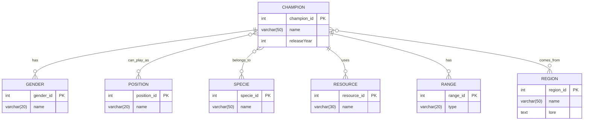

# TP Intégration d'un MCD dans un site web

C'est là qu'on commence à s'amuser.

## Objectif
Intégrer les entités et les relations du Modèle Conceptuel de Données (MCD) de League of Legends dans un projet Laravel existant.

## A. Initialisation du projet

### 1. Mise en place de Laravel

Pour construire le site web, vous n'allez pas créer toute l'architecture vous même. On va utiliser un framework PHP du nom de Laravel dans un conteneur Docker.

Lancer **Docker** en administrateur avec le compte **.\tpdocker**.

Ouvrez un terminal **bash en administrateur** avec le compte **.\tpdocker**. Copiez-collez la commande ci-dessous dans un bloc-note, remplacer `csimon.SNIRW` par votre nom de dossier puis mettez cette commande dnas le bash.

```bash
docker run -p 80:80 -p 443:443 -p 443:443/udp \
    -v D:/csimon.SNIRW/League_of_Branly:/var/www/html \
    shinsenter/laravel:latest
```

A l'issu de cette commande, le conteneur sera lancé et vous pouvez l'utiliser.

Aller à l'URL `localhost` et vous devriez avoir la page de présentation de Laravel.

### 2. Import des assets

Dans votre repository Github `BTS2-CIEL-IR-MCD-2024-2025/League_of_Branly` se trouve un ensemble de différent éléments de code. Récupérer les via Github Desktop et placez les aux bons endroits dans votre dossier `D:/<votreNom.SNIR>/League_of_Branly`.

Après actualisation du site internet, vous devriez voir s'afficher le thème League of Branly. Inspectez la page pour vérifier qu'il n'y a pas d'erreur 404 au chargement des éléments. En cas d'erreurs, corrigez les.


Si vous avez encore l'affichage de la page par défaut de Laravel, essayer les commandes suivantes dans le temrinal de votre conteneur :

```bash
php artisan cache:clear
php artisan view:clear
```

### 3. Visualisation de la base de données

Laravel est livré avec une base de données `SQLite` qui se trouve dans le fichier `database/database.sqlite`. Il s'agit d'un format compacte utile pour des petits projet. 

Afin de pouvoir naviguer facilement dans votre BDD, installez le logiciel [Heidi](https://www.heidisql.com/download.php?download=installer)

Configurez HEIDI avec les paramétres ci-dessous :


## B. Intégration du modèle Entités-Relations

### 0. Le modèle Entités-Relations

Afin de tous partir sur la même base, je vous propose d'implémenter ce MCD :



### 1. Création des migrations

Le fonctionnement des migrations est expliqué [ici](./Migration.md)

Ouvrez le terminal de votre conteneur dans Docker Desktop.

**Tâche :** Créez les migrations pour toutes les tables nécessaires.

```bash
php artisan make:migration create_champions_table
php artisan make:migration create_genders_table
php artisan make:migration create_positions_table
php artisan make:migration create_species_table
php artisan make:migration create_resources_table
php artisan make:migration create_ranges_table
php artisan make:migration create_regions_table
php artisan make:migration create_champion_position_table
php artisan make:migration create_champion_region_table
```

**Question :** Pourquoi créons-nous des tables séparées pour `champion_position` et `champion_region` ?

### 2. Définition des structures des tables

Naviguez vers le dossier `database/migrations`.

**Tâche :** Pour chaque fichier de migration créé, définissez la structure de la table correspondante en vous appuyant sur votre MCD étendu.

Exemple pour la table `champions` :

```php
public function up()
{
    Schema::create('champions', function (Blueprint $table) {
        $table->id();
        $table->string('name', 50);
        $table->integer('release_year');
        $table->foreignId('gender_id')->constrained();
        $table->foreignId('specie_id')->constrained();
        $table->foreignId('resource_id')->constrained();
        $table->foreignId('range_id')->constrained();
        $table->timestamps();
    });
}
```

**Tâche :** Créez des structures similaires pour les autres tables, en adaptant les champs selon les besoins de chaque entité.

**Question :** Quelles différences notez-vous entre la structure de la table champions et celle des autres tables ?

### 3. Création des modèles

**Tâche :** Créez un modèle pour chaque table principale.

```bash
php artisan make:model Champion
php artisan make:model Gender
php artisan make:model Position
php artisan make:model Specie
php artisan make:model Resource
php artisan make:model Range
php artisan make:model Region
```
### 4. Définition des relations dans les modèles

Naviguez vers le dossier `app/Models`.

**Tâche :** Pour chaque modèle, définissez les relations appropriées.

Exemple pour le modèle `Champion` :

```php
class Champion extends Model
{
    use HasFactory;

    protected $fillable = ['name', 'title', 'lore', 'difficulty', 'release_year'];

    public function gender()
    {
        return $this->belongsTo(Gender::class);
    }

    public function positions()
    {
        return $this->belongsToMany(Position::class);
    }

    public function specie()
    {
        return $this->belongsTo(Specie::class);
    }

    public function resource()
    {
        return $this->belongsTo(Resource::class);
    }

    public function range()
    {
        return $this->belongsTo(Range::class);
    }

    public function regions()
    {
        return $this->belongsToMany(Region::class);
    }
}
```

**Tâche :** Définissez les relations pour les autres modèles de manière similaire.

**Question :** Pourquoi utilisons-nous `belongsToMany` pour certaines relations et `belongsTo` pour d'autres ?

### 5. Exécution des migrations

**Tâche :** Exécutez les migrations pour créer les tables dans la base de données.

```bash
php artisan migrate
```

**Question :** Que se passe-t-il si vous exécutez cette commande plusieurs fois ?

**Question finale :** Comment pourriez-vous vérifier que votre structure de base de données a été correctement mise en place ?

Après avoir répondu à ces questions, vous pouvez passer au [TP SQL](./TP_SQL.md)
